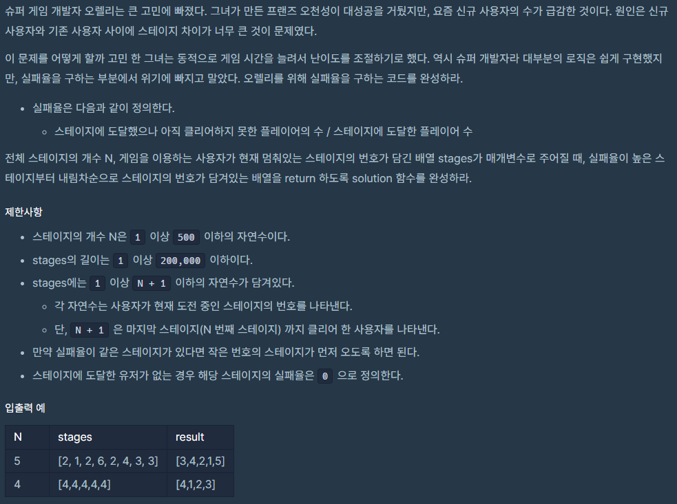

### 문제

URL : https://programmers.co.kr/learn/courses/30/lessons/42889



### 문제풀이

    stages 배열을 순회하면서 멈취있는 위치와, 그 이전에 클리어한 스테이지를 각각 카운팅하고, 스테이지의 실패율을 계산하여 정렬하면 문제가 해결될 것이라고 생각해서 접근하였습니다.

```
import java.util.*;

class Solution {
    class Stage {
        int number;
        float failRate;

        public Stage(int number, float failRate){
            this.number = number;
            this.failRate = failRate;
        }

        public float getFailRate(){
            return this.failRate;
        }
    }

    public int[] solution(int N, int[] stages) {
        int[] answer = {};
        int[] unClearCount = new int[N + 2];
        int[] tryCount = new int[N + 2];

        Arrays.fill(unClearCount, 0);
        Arrays.fill(tryCount, 0);

        for(int i = 0; i < stages.length; i++){
            unClearCount[stages[i]]++;
            for(int j = 1; j <= stages[i]; j++){
                tryCount[j]++;
            }
        }

        List<Stage> list = new LinkedList();
        for(int i = 1; i < N + 1; i++){
            list.add(new Stage(i, (tryCount[i] != 0 ? (float)unClearCount[i] / tryCount[i] : 0)));
        }

        list.sort((o1, o2)-> {
            if(Float.compare(o2.failRate, o1.failRate) == 0) {
                return o1.number - o2.number;
            }else {
                return Float.compare(o2.failRate, o1.failRate);
            }
        });

        answer = list.stream().mapToInt(stage -> stage.number).toArray();

        return answer;
    }
}
```

## Source

프로그래머스 코딩 테스트 연습, https://programmers.co.kr/learn/challenges
